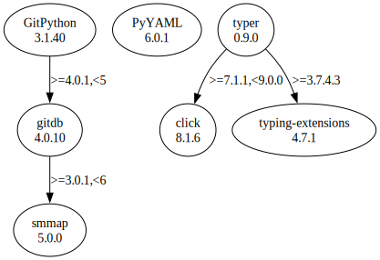

# Third Party Dependencies

<!--[[[fill sbom_sha256()]]]-->
The [SBOM in CycloneDX v1.4 JSON format](https://git.sr.ht/~sthagen/korspollinering/blob/default/sbom.json) with SHA256 checksum ([344b0b0f ...](https://git.sr.ht/~sthagen/korspollinering/blob/default/sbom.json.sha256 "sha256:344b0b0f312326a3bc8e544a5d73476a61e286e0655dff296345f38c456aca24")).
<!--[[[end]]] (checksum: a5f70bda68583552d33a4619f9244742)-->
## Licenses 

JSON files with complete license info of: [direct dependencies](direct-dependency-licenses.json) | [all dependencies](all-dependency-licenses.json)

### Direct Dependencies

<!--[[[fill direct_dependencies_table()]]]-->
| Name                                                           | Version                                              | License     | Author                         | Description (from packaging data)                                    |
|:---------------------------------------------------------------|:-----------------------------------------------------|:------------|:-------------------------------|:---------------------------------------------------------------------|
| [GitPython](https://github.com/gitpython-developers/GitPython) | [3.1.29](https://pypi.org/project/GitPython/3.1.29/) | BSD License | Sebastian Thiel, Michael Trier | GitPython is a python library used to interact with Git repositories |
| [PyYAML](https://pyyaml.org/)                                  | [6.0](https://pypi.org/project/PyYAML/6.0/)          | MIT License | Kirill Simonov                 | YAML parser and emitter for Python                                   |
<!--[[[end]]] (checksum: 5024e14c16129f2353034d1d329e5001)-->

### Indirect Dependencies

<!--[[[fill indirect_dependencies_table()]]]-->
| Name                                                   | Version                                          | License     | Author          | Description (from packaging data)                                   |
|:-------------------------------------------------------|:-------------------------------------------------|:------------|:----------------|:--------------------------------------------------------------------|
| [click](https://palletsprojects.com/p/click/)          | [8.1.3](https://pypi.org/project/click/8.1.3/)   | BSD License | Armin Ronacher  | Composable command line interface toolkit                           |
| [gitdb](https://github.com/gitpython-developers/gitdb) | [4.0.10](https://pypi.org/project/gitdb/4.0.10/) | BSD License | Sebastian Thiel | Git Object Database                                                 |
| [smmap](https://github.com/gitpython-developers/smmap) | [5.0.0](https://pypi.org/project/smmap/5.0.0/)   | BSD License | Sebastian Thiel | A pure Python implementation of a sliding window memory map manager |
<!--[[[end]]] (checksum: 96b6ce9789804a79d61fdc2413fdb173)-->

## Dependency Tree(s)

JSON file with the complete package dependency tree info of: [the full dependency tree](package-dependency-tree.json)

### Rendered SVG

Base graphviz file in dot format: [Trees of the direct dependencies](package-dependency-tree.dot.txt)



### Console Representation

<!--[[[fill dependency_tree_console_text()]]]-->
````console
GitPython==3.1.29
  - gitdb [required: >=4.0.1,<5, installed: 4.0.10]
    - smmap [required: >=3.0.1,<6, installed: 5.0.0]
PyYAML==6.0
````
<!--[[[end]]] (checksum: 10018243e392e8d050efb3f98b192a6e)-->
